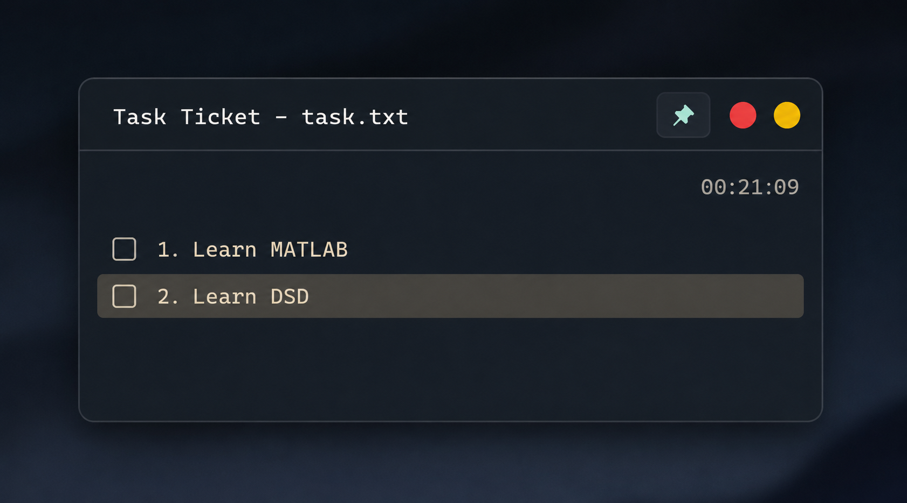

# Task Ticket

A tiny native Win32 desktop widget that sits on your desktop as a
persistent to-do list. No .NET, no Electron, no Qt, no webview — just
C++17 and the Win32 API, targeting well under 40 MB of RAM and effectively
0% idle CPU.



## Features

- Minimalist dark, matte, subtly blurred ("acrylic") borderless widget window.
- Numbered task list with custom-drawn checkboxes.
- Click a checkbox to toggle done/not-done.
- Click the empty area below the last task (or the "+ Add task" hint) to
  add a new task inline — type it, press **Enter** to save or **Esc** to
  cancel.
- Right-click a task for **Delete** / **Mark as Recurring** / **Remove
  Recurring**.
- **Recurring** tasks automatically reset to unchecked at the start of a
  new calendar day — whether that happens because the app has been running
  across midnight, or because it was relaunched on a new day. Non-recurring
  tasks keep their checked state until you manually change it. A small
  cyan dot after a task's text marks it as recurring.
- Pin button (top-right) toggles **always-on-top** (native Win32 topmost,
  not a fake overlay). Cyan = pinned, muted gray-green = unpinned. Starts
  **unpinned** every launch, as requested.
- Position lock: **right-click the header** (anywhere except the buttons)
  for a "Lock Position" / "Unlock Position" menu. When locked, dragging the
  header does nothing. See *Design notes* below for why this is a
  right-click menu instead of a fourth visible button.
- Window position is remembered across restarts (and snapped back onto the
  primary monitor if the saved position is no longer on any connected
  screen).
- Live `HH:MM:SS` clock, updated once per second only.
- Data lives in `%APPDATA%\TaskTicket\tasks.json`, written atomically
  (temp file + rename) so a crash or power loss can't corrupt it.
- Single-instance: launching the EXE twice just brings the existing widget
  to the front.
- DPI-aware (Per-Monitor-V2): looks correct at 100/125/150/200% scaling.

## Design notes / deliberate deviations from a literal reading of the spec

- **Position lock control.** The reference image shows exactly three header
  controls (pin, close, minimize) and no fourth "lock" icon. Rather than
  add a visible button that isn't in the reference image, position locking
  is reachable via **right-click on the header** → *Lock Position*. This
  keeps the header pixel-faithful to the reference while still fully
  implementing the required feature. Task deletion / recurring-toggle uses
  the same right-click-menu pattern the spec explicitly asked for on tasks,
  so this stays consistent.
- **Recurring indicator.** A small dot is drawn after a recurring task's
  text so its state is visible without opening the context menu. This is
  additive and doesn't change the reference layout.
- **Hand-rolled minimal JSON parser/writer** (`Persistence.cpp`) instead of
  pulling in a third-party JSON library. The file schema is small and
  fixed, so ~250 lines of straightforward recursive-descent parsing keeps
  the app dependency-free, in line with "before adding a library, ask: can
  Win32 (or plain C++) do this directly?"
- **Acrylic background** uses the undocumented
  `SetWindowCompositionAttribute` API (resolved dynamically via
  `GetProcAddress`, never linked directly), which is what most lightweight
  native "frosted glass" utilities use. If it's unavailable, the app
  silently falls back to a solid dark matte fill — never a crash, never a
  visual glitch.

## Project layout

```
TaskTicket/
    TaskTicket.h            Data structures, layout constants, class declaration
    TaskTicketApp.cpp        Window creation, DWM/acrylic/rounded corners, painting, DPI, timer
    TaskTicketInput.cpp       Mouse/keyboard handling, hit-testing, task CRUD, context menus, inline editor
    Persistence.cpp           tasks.json load/save (atomic write, minimal JSON parser)
    WinMain.cpp                Entry point + single-instance mutex
    Resource.h / TaskTicket.rc  Resource IDs + manifest embedding
    app.manifest                Per-Monitor-V2 DPI awareness manifest
    tasks.json                  Example data file showing the on-disk schema (not used directly —
                                 the real one is created under %APPDATA%\TaskTicket\)
    CMakeLists.txt               CMake build (used by the GitHub Actions workflow)
    build.bat                    Direct cl.exe build script (no CMake needed)
    .github/workflows/build.yml  Builds TaskTicket.exe in the cloud on every push
```

## Building

You do **not** need the Visual Studio IDE for any of these options.

### Option A — GitHub Actions (no local install at all)

Push this repository to GitHub. The included workflow
(`.github/workflows/build.yml`) builds `TaskTicket.exe` on every push using
a hosted Windows runner and CMake, and uploads it as a downloadable build
artifact from the Actions tab. This is the easiest path if you don't want
to install anything locally.

### Option B — Build Tools for Visual Studio + `build.bat`

1. Install **[Build Tools for Visual Studio](https://visualstudio.microsoft.com/visual-cpp-build-tools/)**
   (free, ~2 GB, not the full IDE) and select the **"Desktop development
   with C++"** workload.
2. Open **"x64 Native Tools Command Prompt for VS 2022"** from the Start
   Menu.
3. `cd` into this folder and run:
   ```
   build.bat
   ```
4. The finished executable is at `build\TaskTicket.exe`.

### Option C — CMake (if you already have CMake + the Build Tools)

```
cmake -B build -S . -A x64
cmake --build build --config Release
```
Output: `build\Release\TaskTicket.exe`.

## Runtime requirements

Windows 10 or 11, 64-bit. No other runtime needs to be installed — the
executable is statically linked against the C++ runtime and uses only
system DLLs (`user32`, `gdi32`, `dwmapi`, `shell32`, `ole32`) that ship
with Windows.

## Data & config location

```
%APPDATA%\TaskTicket\tasks.json
```

Created automatically on first run. Deleting this file resets the widget
to an empty task list.

## Known limitations

- The acrylic blur effect relies on an undocumented Windows API and its
  exact appearance can vary slightly across Windows builds; the app always
  degrades gracefully to a solid dark background if it's unavailable.
- "Start with Windows" is intentionally **not** wired up by default (per
  the spec), but the code is structured so adding a
  `HKCU\...\Run` registry entry later is a small, self-contained addition.
